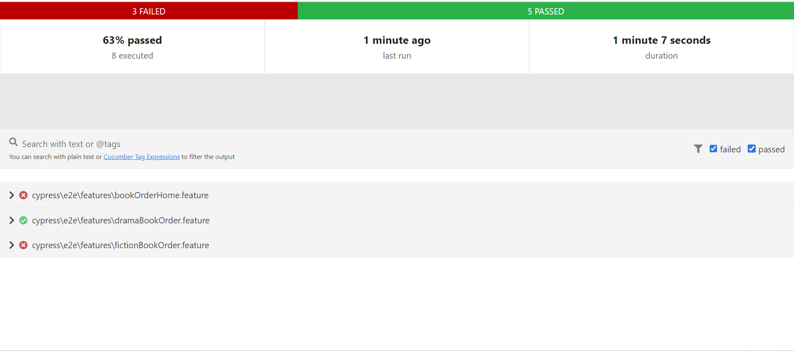

# cypress-cucumber-book-order-app

- ## 💻 Pre-requisites

1. Node JS
2. Any Editor (VS code preffered)

## 🚀 Create Project

[1] Create Project Folder on your machine

[2] Initialise the git for that project folder by 

```git init```

[3] Clone git repo by

```git clone https://github.com/parshuramd/cypress_assesment.git```

[4] change directory to

```cd cypress_assesment```

[5] Install all dependencies by

```npm i```


## Run the test cases:

-[1] for headed mode from terminal

```npx cypress run --headed```

-[2] headless mode

```npx cypress run```

-[3] for cypress runner to open

```npx cypress open```

## Reports

Please go to cypress/reports/report_cucumber.html file after running test cases in headless mode reports will be generated in html format.

below is screenshot of reports for reference


### Queries
  if you have any queries regarding this please reach out to me at dadasparshuram96@gmail.com.